# 🎯 SALBA SYSTEM ARCHITECTURE & INTEGRATION DIAGRAMS
## Complete Visual Reference for Three-Application Emergency Response Platform

---

## 1. COMPLETE SYSTEM ECOSYSTEM DIAGRAM

```mermaid
graph TB
    subgraph Citizens["TIER 1: CITIZEN REPORTING"]
        DS["DisasterSOS Mobile App"]
        DS_comp["Components:"]
        DS_comp1["• Alert Screen"]
        DS_comp2["• Map View"]
        DS_comp3["• History"]
        DS_comp4["• Auth (Email/Google)"]
    end
    
    subgraph Admin["TIER 2: ADMINISTRATION"]
        AW["AdminWebApp Dashboard"]
        AW_comp["Components:"]
        AW_comp1["• Alert Feed"]
        AW_comp2["• Team Manager"]
        AW_comp3["• Real-time Map"]
        AW_comp4["• Reports & PDF"]
    end
    
    subgraph Rescue["TIER 3: RESCUE OPERATIONS"]
        RA["RescuerApp Mobile"]
        RA_comp["Components:"]
        RA_comp1["• Dashboard"]
        RA_comp2["• Mission Map"]
        RA_comp3["• Notifications"]
        RA_comp4["• Profile"]
    end
    
    subgraph Backend["BACKEND SERVICES"]
        Server["Express.js Server"]
        Server_features["Features:"]
        Server_f1["✓ REST APIs"]
        Server_f2["✓ Socket.IO"]
        Server_f3["✓ JWT Auth"]
        Server_f4["✓ ML Integration"]
    end
    
    subgraph Database["DATA PERSISTENCE"]
        DB["MongoDB"]
        DB_collections["Collections:"]
        DB_c1["• users"]
        DB_c2["• reports"]
        DB_c3["• teams"]
        DB_c4["• notifications"]
    end
    
    subgraph External["EXTERNAL SERVICES"]
        OAuth["Google OAuth"]
        ML["ML/AI Service"]
        Notifications["Push Notifications"]
    end
    
    DS -->|POST /alerts| Server
    AW -->|REST + WebSocket| Server
    RA -->|REST + WebSocket| Server
    Server -->|Read/Write| DB
    Server -->|Verify Token| OAuth
    Server -->|Async Processing| ML
    RA -->|Register Token| Notifications
    Server -->|Emit Events| Notifications
    
    style Citizens fill:#e1f5fe
    style Admin fill:#f3e5f5
    style Rescue fill:#e8f5e9
    style Backend fill:#fff3e0
    style Database fill:#fce4ec
    style External fill:#f1f8e9
```

---

## 2. DATA FLOW: FROM ALERT SUBMISSION TO RESOLUTION

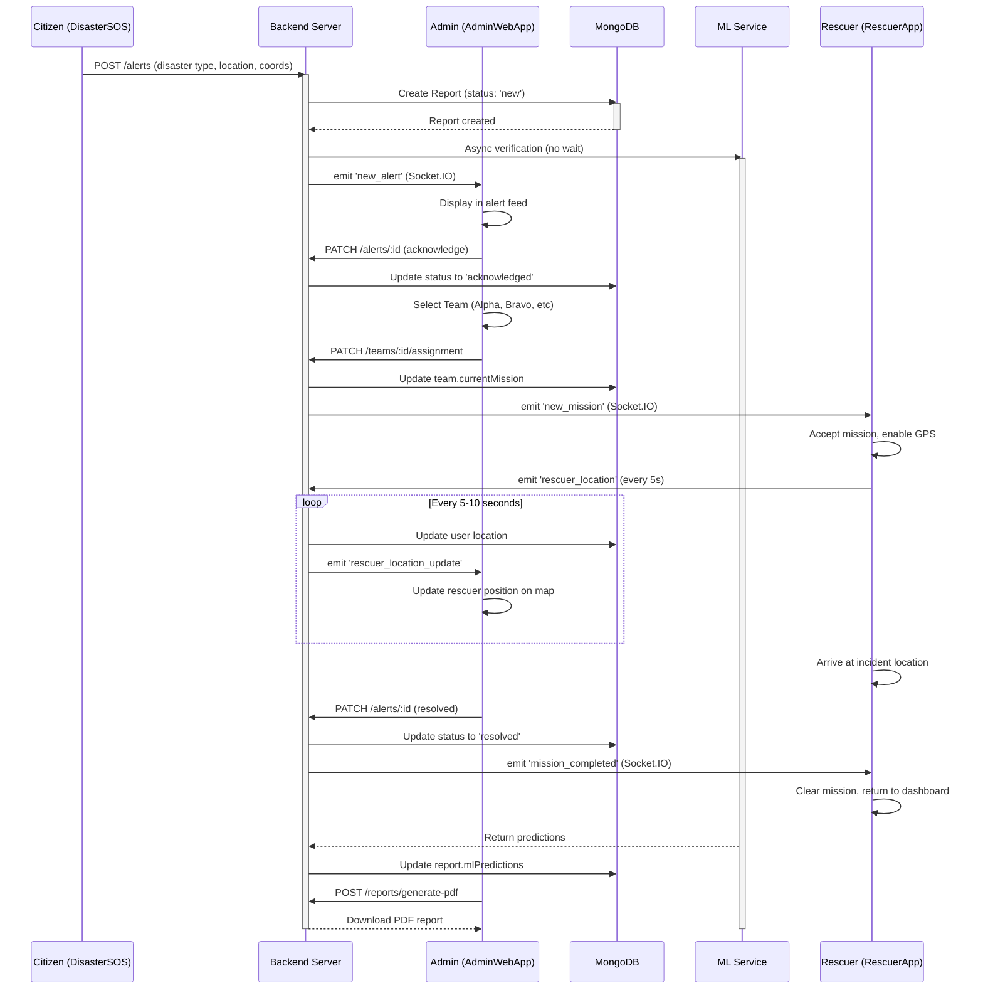

---

## 3. APPLICATION ARCHITECTURE: DISASTERSOS

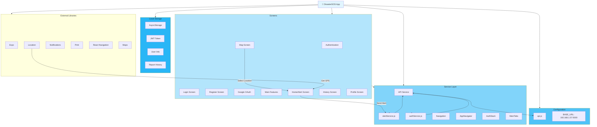

---

## 4. APPLICATION ARCHITECTURE: ADMINWEBAPP

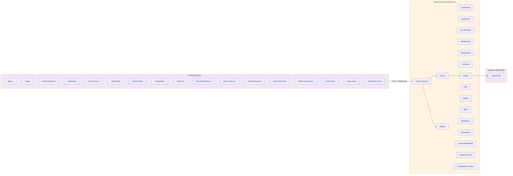

---

## 5. APPLICATION ARCHITECTURE: RESCUERAPP

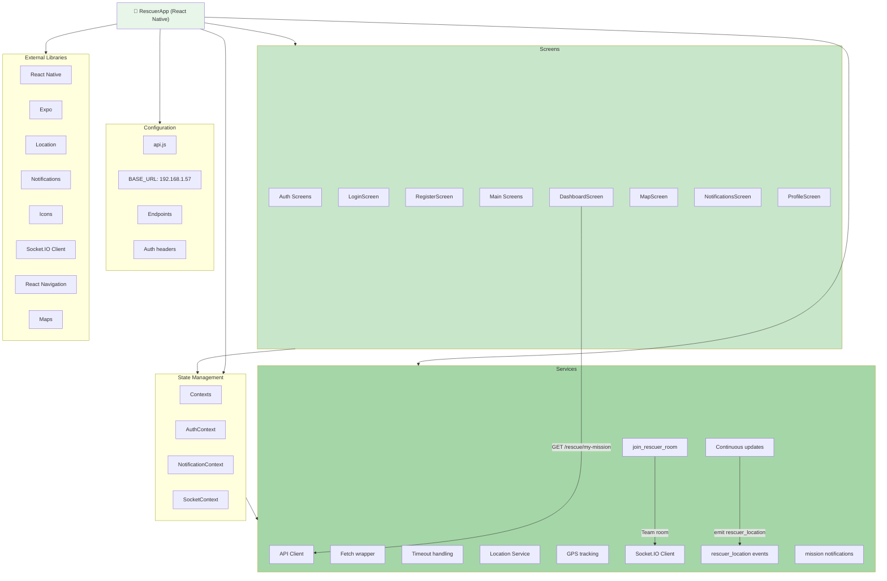

---

## 6. API COMMUNICATION MATRIX

```mermaid
graph TB
    subgraph DS["DisasterSOS"]
        DS1["POST /alerts"]
        DS2["GET /locations/barangays"]
        DS3["POST /auth/register"]
        DS4["POST /auth/login"]
        DS5["POST /auth/google"]
    end
    
    subgraph AW["AdminWebApp"]
        AW1["GET /alerts"]
        AW2["PATCH /alerts/:id"]
        AW3["GET /teams"]
        AW4["PATCH /teams/:id"]
        AW5["GET /reports"]
        AW6["POST /reports/generate-pdf"]
        AW7["POST /ml/verify-report"]
    end
    
    subgraph RA["RescuerApp"]
        RA1["GET /rescue/my-mission"]
        RA2["GET /rescue/my-team"]
        RA3["GET /rescue/notifications"]
        RA4["PATCH /rescue/notifications/:id"]
        RA5["POST /rescue/push-token"]
        RA6["POST /rescue/status"]
    end
    
    subgraph Server["Express.js Backend"]
        Auth["Auth"]
        Alerts["Alerts"]
        Rescue["Rescue"]
        Teams["Teams"]
        Reports["Reports"]
        ML["ML/AI"]
    end
    
    DS1 --> Alerts
    DS3 --> Auth
    DS4 --> Auth
    DS5 --> Auth
    DS2 --> Alerts
    
    AW1 --> Alerts
    AW2 --> Alerts
    AW3 --> Teams
    AW4 --> Teams
    AW5 --> Reports
    AW6 --> Reports
    AW7 --> ML
    
    RA1 --> Rescue
    RA2 --> Rescue
    RA3 --> Rescue
    RA4 --> Rescue
    RA5 --> Rescue
    RA6 --> Rescue
    
    style DS fill:#e1f5fe
    style AW fill:#f3e5f5
    style RA fill:#e8f5e9
    style Server fill:#fff3e0
```

---

## 7. REAL-TIME COMMUNICATION: WEBSOCKET FLOW

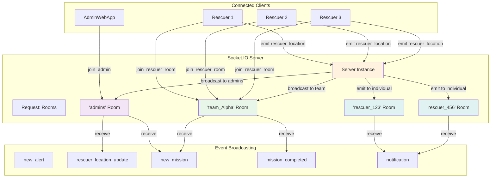

---

## 8. ALERT LIFECYCLE STATE MACHINE

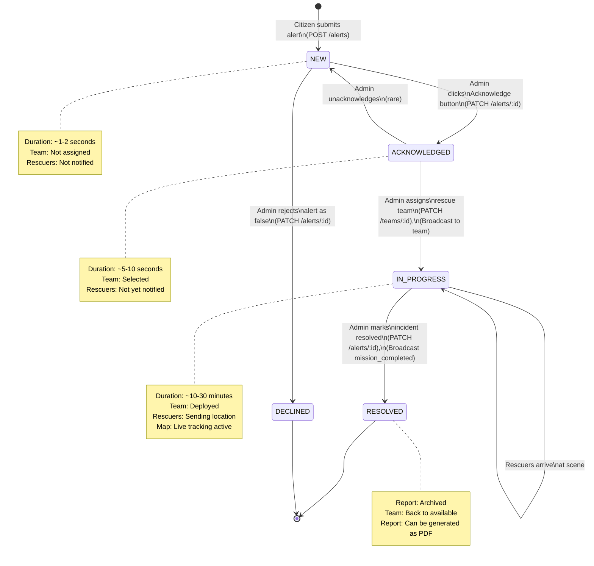

---

## 9. USER ROLE-BASED ACCESS CONTROL

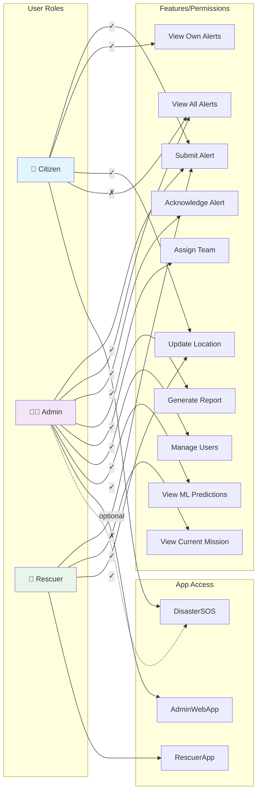

---

## 10. DATABASE RELATIONSHIP DIAGRAM

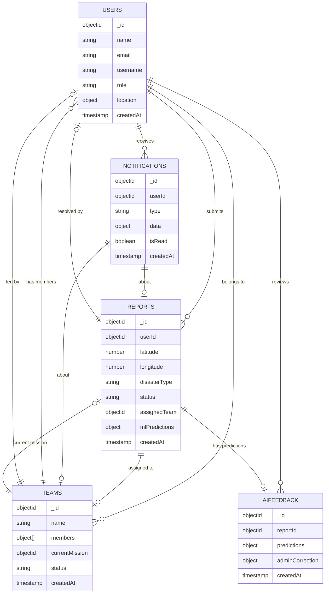

---

## 11. DEPLOYMENT ARCHITECTURE

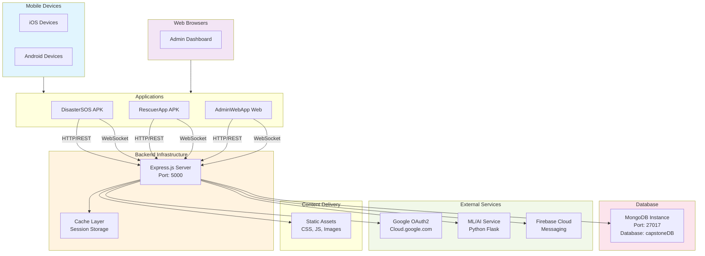

---

## 12. DATA FLOW: ALERT TO RESOLUTION

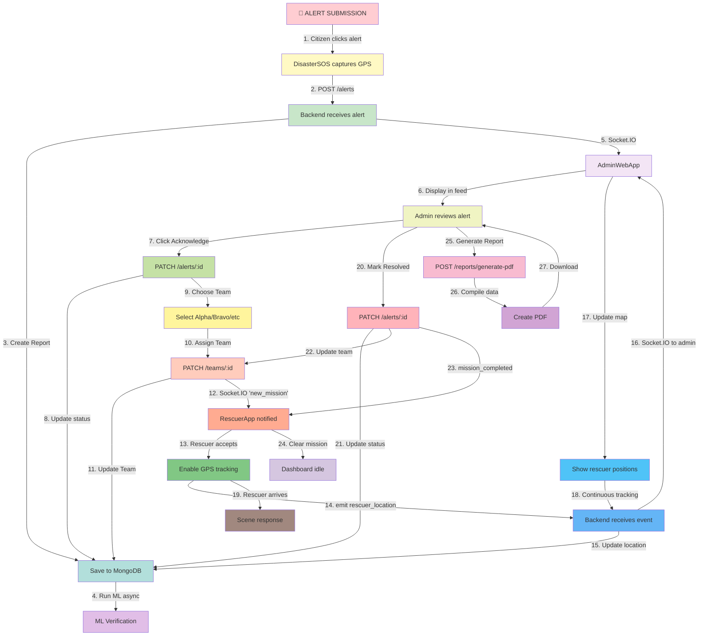

---

## 13. AUTHENTICATION FLOW

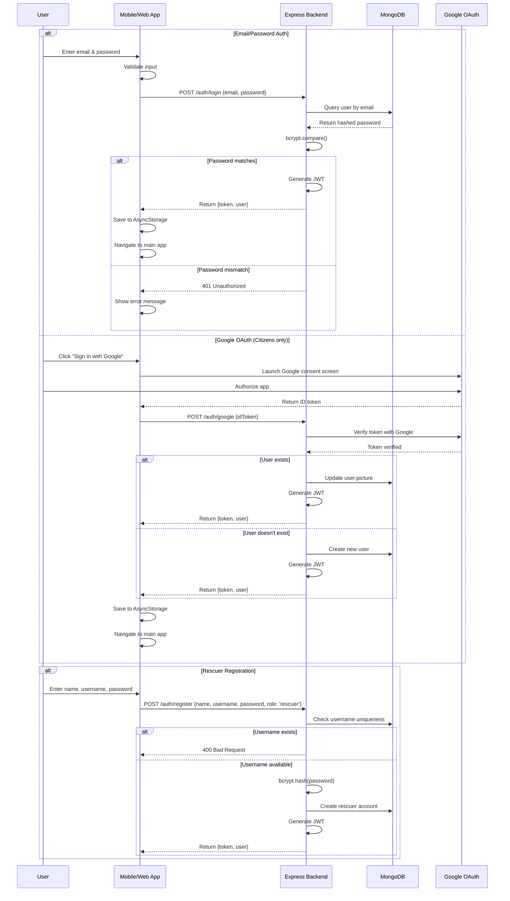

---

## 14. LOCATION TRACKING & MAPPING

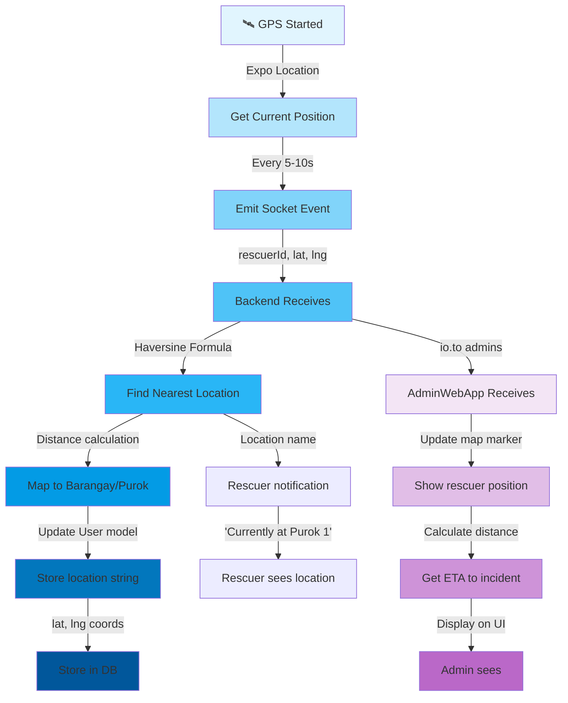

---

## 15. ERROR HANDLING & RESILIENCE

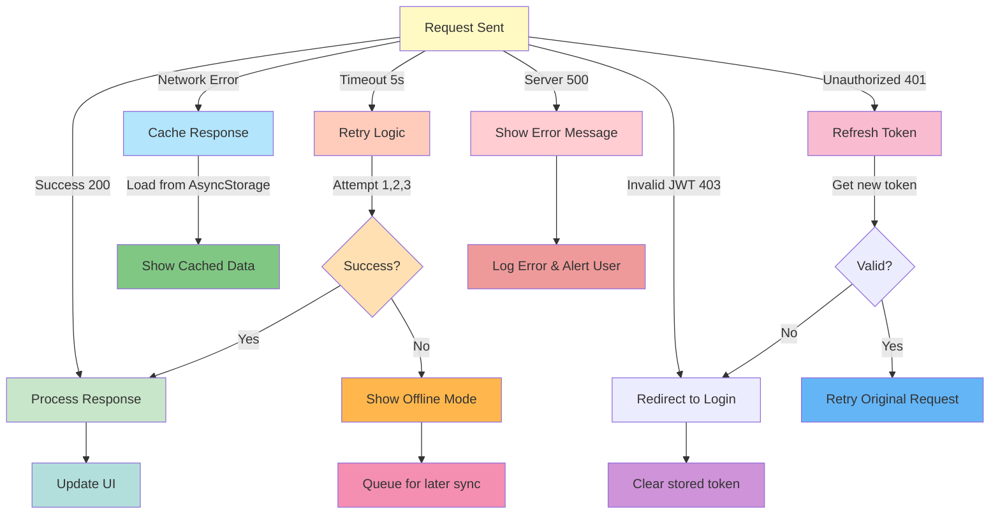

---

## Summary of Key Integration Points

| **Component** | **Communicates With** | **Protocol** | **Purpose** |
|---|---|---|---|
| DisasterSOS | Backend | REST (HTTP) | Alert submission, auth, location lookup |
| AdminWebApp | Backend | REST + WebSocket | Alert management, team assignment, real-time updates |
| RescuerApp | Backend | REST + WebSocket | Mission retrieval, location publishing, notifications |
| Backend | MongoDB | Driver | Data persistence |
| Backend | Google OAuth | HTTPS | Token verification |
| Backend | ML Service | HTTP | Async prediction & verification |
| Backend | Firebase/Expo | HTTPS | Push notifications |
| All Apps | Backend | WebSocket (Socket.IO) | Real-time events (alerts, missions, locations) |

---

**Architecture Version:** 1.0  
**Last Updated:** April 5, 2026  
**Visualization Tool:** Mermaid  
**Status:** Complete
