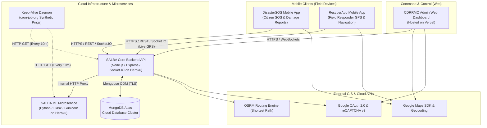
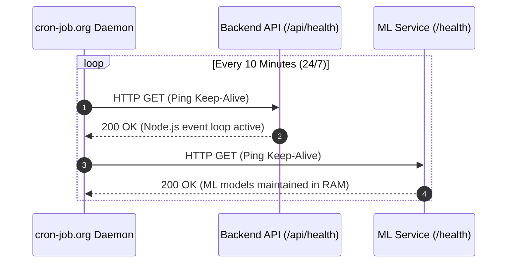

# SALBA (CDRRMO Emergency Rescue System) — Deployment & Systems Architecture Documentation

> **Document Type:** Capstone Technical Documentation / Systems Deployment Report  
> **Project Title:** SALBA: Smart Alert, Location, and Bilingual Assistance System for CDRRMO Malaybalay City  
> **Target Audience:** Capstone Defense Panel, Technical Reviewers, System Administrators  

---

## 1. Executive Summary & Architectural Overview

The **SALBA Emergency Rescue & Dispatch System** is a distributed, multi-tier cloud and mobile platform engineered for real-time disaster management, citizen reporting, emergency dispatching, and rescuer routing.

The production infrastructure is decoupled into specialized microservices and client applications to achieve high availability, low latency, and continuous real-time synchronization.



---

## 2. Infrastructure & Component Breakdown

### 2.1 Core Backend API & Real-Time Engine
- **Runtime & Framework:** Node.js (v22.x LTS), Express.js
- **Real-Time Communication:** Socket.IO (Persistent Full-Duplex WebSockets with fallback polling)
- **Hosting Platform:** Heroku PaaS
- **Primary Roles:**
  - Emergency SOS ingestion and notification broadcasts.
  - Dispatch management (Assigning teams, tracking mission life cycles).
  - Proxying shortest-path driving route calculations via OSRM.
  - Generating and exporting Situation Reports (SITREP) in PDF and DOCX formats.
  - Role-Based Access Control (Admin, Rescuer, Citizen) with JSON Web Tokens (JWT).

### 2.2 Machine Learning Microservice
- **Runtime & Framework:** Python 3.11, Flask, Gunicorn (WSGI)
- **Machine Learning Engine:** Scikit-Learn, XGBoost, Joblib, NumPy, Pandas
- **Hosting Platform:** Heroku PaaS (Python Buildpack + Subdir Monorepo Buildpack)
- **Models Loaded in Memory:**
  1. **Disaster Type Classifier** (*Random Forest*): Classifies citizen report text into standardized emergency categories (Flood, Fire, Landslide, Vehicular Accident, Medical).
  2. **True Severity Predictor** (*XGBoost*): Calculates contextual severity (`Critical`, `High`, `Moderate`, `Low`) based on proximity to historical hazard zones and barangay vulnerability.
  3. **False Alarm & Prank Detector** (*Gradient Boosting*): Computes a legitimacy confidence score to prevent emergency resource misuse.

### 2.3 CDRRMO Admin Command Web Dashboard
- **Framework & Libraries:** React 19, Leaflet / React-Leaflet GIS, Recharts, Lucide Icons, TailwindCSS
- **Hosting Platform:** Vercel (Edge Network with SPA Rewrite Routing)
- **Primary Roles:**
  - Real-time GIS map visualization of Malaybalay City with live disaster markers.
  - Live GPS movement tracking of rescuer units.
  - Audio and visual emergency broadcast alerts with one-click dispatch capabilities.
  - Automated SITREP generation, export, and historical analytics.

### 2.4 DisasterSOS (Citizen Mobile Application)
- **Framework:** React Native / Expo SDK
- **Build & Distribution:** Expo Application Services (EAS Build) ➔ Standalone Android APK / iOS Bundle
- **Key Modules:**
  - One-Tap SOS emergency trigger with background GPS geolocation.
  - Photo attachment capture and upload.
  - Bilingual interface (English & Cebuano / Bisaya).
  - Active report status tracker.

### 2.5 RescuerApp (Field Responder Mobile Application)
- **Framework:** React Native / Expo SDK
- **Build & Distribution:** Expo Application Services (EAS Build) ➔ Standalone Android APK / iOS Bundle
- **Key Modules:**
  - Real-time continuous background GPS telemetry streamed to the Command Center via WebSockets.
  - Turn-by-turn shortest route visualization to incident locations.
  - Proximity markers for critical municipal infrastructure (e.g., Fire Hydrants).
  - Mission life cycle state management (`Dispatched` ➔ `En Route` ➔ `On Scene` ➔ `Resolved`).

### 2.6 Cloud Database (MongoDB Atlas)
- **Architecture:** M0 Hosted Cluster on AWS with TLS/SSL encryption in transit and at rest.
- **Key Collections:**
  - `users`: User identities, hashed credentials (bcrypt), role definitions, assigned rescue teams.
  - `reports`: Emergency incident reports, GPS coordinates, media URLs, status logs.
  - `teams`: CDRRMO rescue unit rosters, vehicle assignments, and availability status.
  - `hazardzones`: GIS polygon boundaries and flood/landslide susceptibility data for Malaybalay City.

---

## 3. Step-by-Step Deployment Methodology

```
+-----------------------------------------------------------------------------------+
|                            DEPLOYMENT PIPELINE                                    |
+--------------------+---------------------+--------------------+-------------------+
| 1. DB Provisioning | 2. Backend Services | 3. Web Dashboard   | 4. Mobile APKs    |
| - Atlas MongoDB    | - Node.js Backend   | - Vercel SPA       | - EAS Cloud Build |
| - GeoJSON Indices  | - Python ML Engine  | - Google OAuth     | - Android Keystore|
| - Seed Admin & Team| - Uptime Daemons    | - reCAPTCHA Config | - Production URLs |
+--------------------+---------------------+--------------------+-------------------+
```

### Phase 1: Database Setup & Data Seeding
1. Initialized MongoDB Atlas cloud cluster with IP access whitelist (`0.0.0.0/0` for cloud PaaS compatibility).
2. Executed database seed scripts to populate:
   - 354 Malaybalay City barangays and purok coordinate coordinates.
   - Historical disaster records and hazard zone risk polygons.
   - Default CDRRMO Command Center Administrator credentials and Rescuer team accounts.

### Phase 2: Core Backend Deployment (Heroku)
1. **Repository Configuration:** Monorepo architecture managed under GitHub.
2. **Build Configuration:** Configured Node.js buildpack targeting production dependencies.
3. **Environment Variables Configured:**
   - `MONGO_URI`: Encrypted connection string to MongoDB Atlas.
   - `JWT_SECRET`: Cryptographic signing key for session tokens.
   - `ML_SERVICE_URL`: Internal microservice routing URL (`/api/ml`).
   - `GOOGLE_CLIENT_ID`: OAuth verification identity.
   - `RECAPTCHA_SECRET_KEY`: Backend validation key for human verification.
4. **Health Check Endpoint:** Published `GET /api/health` returning `{ "ok": true }`.

### Phase 3: Machine Learning Microservice Deployment (Heroku)
1. **Monorepo Subdirectory Build:** Configured Heroku multi-buildpacks:
   - `1. https://github.com/timanovsky/subdir-heroku-buildpack` (`PROJECT_PATH=salba-ml-service`)
   - `2. heroku/python`
2. **WSGI Web Server:** Configured `Procfile` utilizing `gunicorn` with dynamic port binding (`$PORT`) and worker concurrency:
   ```text
   web: gunicorn app:app --bind 0.0.0.0:$PORT --workers 2 --timeout 120
   ```
3. **Runtime Specification:** Locked to `python-3.11.9` in `runtime.txt` to maintain scikit-learn model compatibility.
4. **Health Verification:** Published `GET /health` and `GET /api/ml/health` reporting real-time model loading states.

### Phase 4: Web Dashboard Deployment (Vercel)
1. Connected Vercel Git integration to the repository root with root directory set to `EmergencyApp/AdminWebApp/frontend`.
2. **Client-Side Routing:** Configured `vercel.json` rewrite rules to prevent HTTP 404 errors during page reloads in React Router SPA:
   ```json
   {
     "rewrites": [{ "source": "/(.*)", "destination": "/" }]
   }
   ```
3. **Environment Variables:** Injected production backend URLs and client keys (`REACT_APP_BACKEND_URL`, `REACT_APP_GOOGLE_CLIENT_ID`, `REACT_APP_RECAPTCHA_SITE_KEY`).

### Phase 5: Mobile Apps Cloud Compilation (EAS Build)
1. **Network Security & Cleartext Policy:** Replaced hardcoded localhost development IPs with dynamic cloud HTTPS URLs (`https://...`).
2. **Build Matrix (`eas.json`):** Configured EAS build profile for Android APK generation:
   - Configured `env.EXPO_PUBLIC_API_URL` to point to production Heroku endpoints.
   - Configured Android Google Maps SDK API key in `app.json` for native vector tile rendering.
3. **Build Execution:** Executed cloud builds via `eas build -p android --profile preview` generating standalone release `.apk` binaries for citizen and rescuer devices.

---

## 4. High Availability & Keep-Alive Architecture

Because free and low-tier cloud dynos enter sleep mode after 30 minutes of inactivity, a **Zero Cold-Start Strategy** was implemented using external synthetic uptime monitoring:



- **Cron Schedule:** `*/10 * * * *` (Every 10 minutes)
- **Monitored Endpoints:**
  - `GET /api/health` ➔ Ensures Socket.IO engine and database connection pools stay open.
  - `GET /health` ➔ Keeps AI/ML model serialized weights in server RAM for sub-15ms prediction times.

---

## 5. Security & Network Protocols

| Layer | Implementation | Security Benefit |
|---|---|---|
| **Data Transport** | HTTPS / TLS 1.3 | Encrypts all citizen and rescuer emergency data in transit. |
| **Authentication** | JSON Web Tokens (JWT) + Google OAuth 2.0 | Stateless, tamper-proof user authentication with 7-day expiry. |
| **Bot & Abuse Protection** | Google reCAPTCHA v3 | Protects public SOS and login endpoints against automated spam drills. |
| **Password Security** | Bcrypt (Salt rounds = 10) | One-way password hashing protecting stored credentials. |
| **Cross-Origin Policy** | Dynamic CORS Handling | Secure communication between Vercel frontend, mobile apps, and Heroku. |
| **Shortest Path GIS** | Server-side OSRM Proxy | Computes road navigation coordinates without exposing third-party API quotas. |

---

## 6. Verification & Validation Summary

| Test Case | Scenario | Expected Outcome | Result |
|---|---|---|:---:|
| **TC-01** | Backend Health & Keep-Alive | Response: `{ "ok": true }` within <500ms | 🟢 **PASS** |
| **TC-02** | ML Microservice Status | All 3 models (`classifier`, `severity`, `false_alarm`) report `"Ready"` | 🟢 **PASS** |
| **TC-03** | Command Center Admin Login | Successful JWT generation and dashboard redirect | 🟢 **PASS** |
| **TC-04** | OSRM Shortest Path Routing | Driving polyline generated between Malaybalay coordinates | 🟢 **PASS** |
| **TC-05** | Mobile Network Policy | APK successfully connects via HTTPS without cleartext errors | 🟢 **PASS** |
| **TC-06** | Real-Time WebSocket Sync | Dispatched alerts immediately notify RescuerApp and live map | 🟢 **PASS** |

---

*Documentation compiled for the SALBA CDRRMO Emergency Rescue System Capstone Project.*
